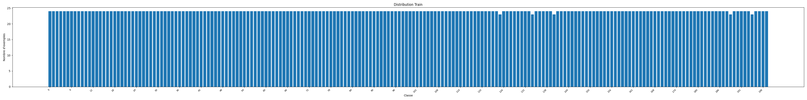
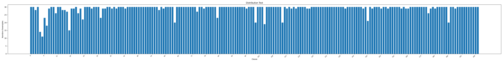
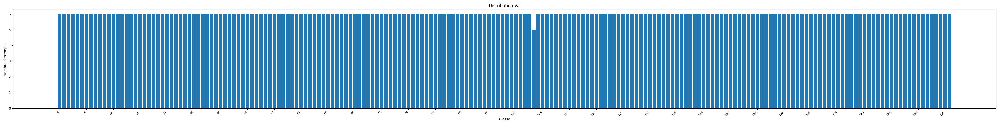
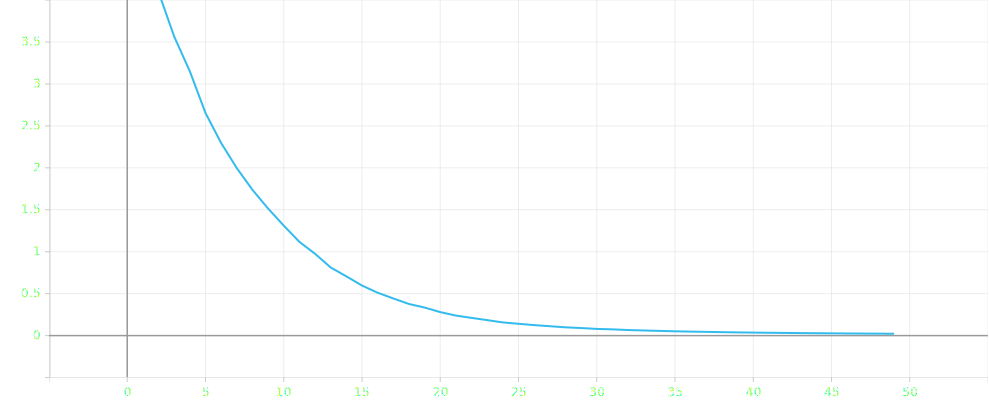
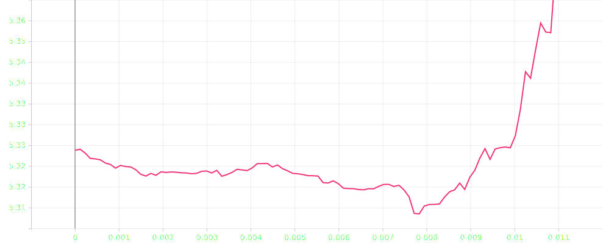

# Rapport de projet — CSC8607 : Introduction au Deep Learning

> **Consignes générales**
>
> - Tenez-vous au **format** et à l’**ordre** des sections ci-dessous.
> - Intégrez des **captures d’écran TensorBoard** lisibles (loss, métriques, LR finder, comparaisons).
> - Les chemins et noms de fichiers **doivent** correspondre à la structure du dépôt modèle (ex. `runs/`, `artifacts/best.ckpt`, `configs/config.yaml`).
> - Répondez aux questions **numérotées** (D1–D11, M0–M9, etc.) directement dans les sections prévues.

---

## 0) Informations générales

- **Étudiant·e** : _DUMANGE, Valentine_
- **Projet** : _CUB-200-2011 (oiseaux, 200 espèces) avec convolutions groupées (grouped convolutions) (CUB-200-2011 × CNN 2D à 3 stages)_
- **Dépôt Git** : _[URL publique](https://github.com/valentinedum/csc8607_projects)_
- **Environnement** : `python == 3.10.18`, `torch == 2.5.1`, `cuda == 12.1`  
- **Commandes utilisées** :
  - Entraînement : `python -m src.train --config configs/config.yaml`
  - LR finder : `python -m src.lr_finder --config configs/config.yaml`
  - Grid search : `python -m src.grid_search --config configs/config.yaml`
  - Évaluation : `python -m src.evaluate --config configs/config.yaml --checkpoint artifacts/best.ckpt`

---

## 1) Données

### 1.1 Description du dataset

- **Source** (lien) : <https://huggingface.co/datasets/dpdl-benchmark/caltech_birds2011>
- **Type d’entrée** (image / texte / audio / séries) : images et textes
- **Tâche** (multiclasses, multi-label, régression) : classification multiclasses
- **Dimensions d’entrée attendues** (`meta["input_shape"]`) : images de tailles variées, après normalisation -> 224×224
- **Nombre de classes** (`meta["num_classes"]`) :  200 classes d’oiseaux

**D1.** Quel dataset utilisez-vous ? D’où provient-il et quel est son format (dimensions, type d’entrée) ?

Nous allons utiliser le dataset de huggingface nommé caltech_birds2011 (url ci-dessus). C'est un dataset avec des images d'oiseaux ainsi que leur espece (texte). Les images sont de tailles variables.

### 1.2 Splits et statistiques

| Split | #Exemples | Particularités (déséquilibre, longueur moyenne, etc.) |
| ----: | --------: | ----------------------------------------------------- |
| Train |      4795 |         équilibré, pas de labels manquants,     images de tailles variées                                      |
|   Val |      1199 |           équilibré, pas de labels manquants, iamges de tailles variées                                           |
|  Test |      5794 |               déséquilibré,    pas de labels manquants , images de tailles variées                                   |

**D2.** Donnez la taille de chaque split et le nombre de classes.  
Il y a 200 classes dans chaque split et le train fait 4795 lignes, le validation 1199, le test 5794 (voir dans le script `src/analysis`).

**D3.** Si vous avez créé un split (ex. validation), expliquez **comment** (stratification, ratio, seed).
Dans mon dataset, j'avais initialement aucun set de validation. J'ai donc créé mon propre split à partir du train en appliquant une stratification par classe avec un ratio de 80% train / 20% val.
La seed a été fixée à 42 pour permettre la reproductibilité.

**D4.** Donnez la **distribution des classes** (graphique ou tableau) et commentez en 2–3 lignes l’impact potentiel sur l’entraînement.  
La distribution des classes montrent que les ensembles Train et Val sont très équilibrés, il ya autant d'échantillons (24) dans chaque classe. A l'inverse le dataset Test est moins équilibré. La plupart des classes ont 30 échantillons mais certains en ont moins avec 12 échantillons, ou une vingtaine.
Des graphiques ont été plotés via tensorboard.




**D5.** Mentionnez toute particularité détectée (tailles variées, longueurs variables, multi-labels, etc.).
Ce dataset a très peu de particularités. Il n'a aucun label manquant. Ces images sont toutes en RGB mais sont par contres de tailles très différentes, on compte 5 différentes tailles d'images.
Toutefois le test set est assez déséquilibré comme dit précédemment.

### 1.3 Prétraitements (preprocessing) — _appliqués à train/val/test_

Listez précisément les opérations et paramètres (valeurs **fixes**) :

- Vision : resize = [224, 224], center-crop = None, normalize = (mean=[0.48185426, 0.50031734, 0.42832923], std=[0.2270571, 0.2226704, 0.26213554])

**D6.** Quels **prétraitements** avez-vous appliqués (opérations + **paramètres exacts**) et **pourquoi** ?
Comme indiqué en D5 , les images du dataset ont des tailles très variés. Seulement les réseaux de neurones convolutifs ont besoin d'une entrée à taille fixe. Nous redimensionnons donc les images à [224, 224]. Après le resizing, il est important de transformer l'image en tenseur pour pouvoir la traiter avec pytorch. Puis nous normalisons notre tenseur avec mean=[0.48185426, 0.50031734, 0.42832923] et std=[0.2270571, 0.2226704, 0.26213554] car après analyse ce sont les statistiques que nous avons à propos du dataset d'entrainement. Autrement nous aurions pu trouver sur internet les paramètres moyens des datasets d'images connues tels que ImageNet et approximer par ceux-ci.
NB: Je n'ai pas fait de center-crop car un redimensionnement de l'image avait déjà été fait. On ne voudrait pas qu'une partie de l'oiseau soit accidentellement coupée.

**D7.** Les prétraitements diffèrent-ils entre train/val/test (ils ne devraient pas, sauf recadrage non aléatoire en val/test) ? Tous mes prétraitements sont les mêmes pour train, val et test pour être sur que l'évaluation sera représentative. Toutefois train recevra en plus de stransformations d'augmentation de données.

### 1.4 Augmentation de données — _train uniquement_

- Liste des **augmentations** (opérations + **paramètres** et **probabilités**) :
  - Flip horizontal p=0.5
  - Colorjitter très léger (brightness=0.05, contrast=0.05, saturation=0, hue=0)

**D8.** Quelles **augmentations** avez-vous appliquées (paramètres précis) et **pourquoi** ?  
Nous avons appliqué à notre dataset plusieurs augmentations car nous avons un risque de surapprentissage avec très peu d'images par classe (24 environ). Pour que le modèle devienne plus robuste, nous appliquons un randomHorizontalFlip de probabilité 0.5 car un oiseau est le même qu'il soit tourné vers la droite ou la gauche. Nous allons ainsi rendre le modèle invariant à cela.
Nous allons aussi prendre en compte le fait que les photos ont pu être prises sous différentes conditions d'éclairage. Les paramètres Variations aléatoires de luminosité (±5%), contraste (±5%).
On rendra ainsi le modèle robuste aux changements d'orientation.

**D9.** Les augmentations **conservent-elles les labels** ? Justifiez pour chaque transformation retenue.
Oui, les transformations conservent les labels, c'est bien le plus important. Le modèle doit comprendre quel est l'oiseau, qu'il ait la tête à droite ou à gauche, qu'il ait été pris plus ou moins au soleil. Il reste de la même espèce.

### 1.5 Sanity-checks

- **Exemples** après preprocessing/augmentation (insérer 2–3 images/spectrogrammes) :

> 
> 
> 

**D10.** Montrez 2–3 exemples et commentez brièvement.  
Les 3 images au-dessus sont de haut en bas:

- l'image originale
- l'image après augmentation
- l'image après augmentation puis preprocessing

Avec cet exemple, nous remarquons en effet que l'image avait une chance sur deux de connaitre une symétrie horizontale lors de l'augmentation. Elle a, en effet changé d'horientation. Sinon, elle a un petit peu changé en termes de couleurs mais c'est très peu perceptible. L'augmentation semble avoir bien fonctionné.

Puis le preprocessing a normalisé les couleurs de l'image d'où le changement marquant lors de l'affichage et surtout on a redimensionné l'image afin qu'elle soit en format carré de 224 par 224. Le preprocessing a lui aussi bien fonctionné.

D'autres images sont disponibles dans le dossier : `artifacts/data_analysis`

**D11.** Donnez la **forme exacte** d’un batch train (ex. `(batch, C, H, W)` ou `(batch, seq_len)`), et vérifiez la cohérence avec `meta["input_shape"]`.
D'après la sortie de mon script de test dans data_loading, la forme exact de sortie d'un batch est (32, 3, 224, 224). Ce qui est cohérent avec le "batch_size" et "input_shape" inscrit dans les configs (exécuter `python src/data_loading`)

---

## 2) Modèle

### 2.1 Baselines

**M0.**

- **Classe majoritaire** — Métrique : `Accuracy` → score = `0.52%`
- **Prédiction aléatoire uniforme** — Métrique : `Accuracy` → score = `0.41%`  
Ces scores très faibles (proches de 1/200 = 0.5%) confirment que le dataset est équilibré et ne présentent pas de biais. Notre modèle devra faire mieux que ces scores en apprenant des caractéristiques discriminantes
(voir dans `src/analysis`)

### 2.2 Architecture implémentée

- **Description couche par couche** (ordre exact, tailles, activations, normalisations, poolings, résiduels, etc.) :
  - Input → 3×224×224
  - Initialization : Conv 3×3 (64 canaux, padding 1) → BatchNorm → ReLU.
  - Stage 1 (répéter 2 fois) :
    - Conv 3×3 (64 → 64, padding 1) → BatchNorm → ReLU.
    - Conv 3×3 (64 → 64, padding 1, groups = G) → BatchNorm → ReLU.
  - MaxPool 2×2
  - Stage 2 (répéter 2 fois) :
    - Conv 3×3 (64 → 128, padding 1) → BatchNorm → ReLU.
    - Conv 3×3 (128 → 128, padding 1, groups = G) → BatchNorm → ReLU.
  - MaxPool 2×2
  - Stage 3 (répéter 2 fois) :
    - Conv 3×3 (128 → 256, padding 1) → BatchNorm → ReLU.
    - Conv 3×3 (256 → 256, padding 1, groups = G) → BatchNorm → ReLU.
  - Global Average Pooling
  - Tête linéaire (256 → 200) → logits (dimension = nb classes)

Remarque : pour que groups=G soit valide, le nombre de canaux de la convolution doit être divisible par G.

- **Loss function** :
  - Multi-classe : CrossEntropyLoss

- **Sortie du modèle** : forme = **(32, 200)**

- **Nombre total de paramètres** : `2012488`

**M1.** Décrivez l’**architecture** complète et donnez le **nombre total de paramètres**.  
Expliquez le rôle des **2 hyperparamètres spécifiques au modèle** (ceux imposés par votre sujet).
L'architecture est un réseau de neurones convolutif (CNN) divisé en trois étages principaux, où chaque étage est constitué d'une suite de blocs répétant des opérations de convolution, de normalisation (BatchNorm) et d'activation non-linéaire (ReLU). La taille des images diminue progressivement grâce à des couches de MaxPool, jusqu'à une agrégation finale par moyenne (Average Pooling) avant la classification.
Ce réseau totalise 2 012 488 paramètres entraînables. Concernant les hyperparamètres imposés, l'utilisation de convolutions groupées (G=2) permet de diviser les connexions entre canaux pour réduire le coût de calcul et éviter le surapprentissage, tandis que le nombre de blocs par stage (N=2) joue sur la profondeur du réseau pour permettre l'apprentissage de motifs plus ou moins complexes.

### 2.3 Perte initiale & premier batch

- **Loss initiale attendue** (multi-classe) ≈ `-log(1/num_classes) = 5.2983`
- **Observée sur un batch** : `5.3239`
- **Vérification** : backward OK, gradients ≠ 0

**M2.** Donnez la **loss initiale** observée et dites si elle est cohérente. Indiquez la forme du batch et la forme de sortie du modèle.
La loss initiale est de 5.3239, ce qui est cohérent avec la loss théorique (tirée de la loi uniforme) = 5.2983.
Le batch d'entrée est de taille (32, 3, 224, 224), ce qui confirme que le modèle traite bien un batch de 32 images RVB de taille 224x224. La sortie du modèle (32, 200) correspond bien à un loggit avec 200 classes

---

## 3) Overfit « petit échantillon »

- **Sous-ensemble train** : `N = 16` exemples
- **Hyperparamètres modèle utilisés** (les 2 à régler) : `Nombre de groupes G = 2`, `Nombre de blocs par stage = 2`
- **Optimisation** : LR = `0.001`, weight decay = `0.0` (0 ou très faible recommandé)
- **Nombre d’époques** : `50`

>

**M3.** Donnez la **taille du sous-ensemble**, les **hyperparamètres** du modèle utilisés, et la **courbe train/loss** (capture). Expliquez ce qui prouve l’overfit.
Nous avons pris un sous ensemble de 16 images avec les hyperparamètres Nombre de groupes = 2 et nombre de bloc par stage = 2.
Avec la courbe de train/loss du dessus, on comprend qu'au bout d'à peine 20 epochs, le modèle ne fait quasi plus d'erreur (loss~=0 soit loss = 0.022108). Le modèle connait "par coeur" le sous ensemble, il fait preuve d'overfit.

---

## 4) LR finder

- **Méthode** : balayage LR (log-scale), quelques itérations, log `(lr, loss)`
- **Fenêtre stable retenue** : `8e-4 → 3e-3`
- **Choix pour la suite** :
  - **LR** = `1e-3`
  - **Weight decay** = `1e-4` (valeurs classiques : 1e-5, 1e-4)

**Courbe de la loss en fonction du learning rate**
> 

**M4.** Justifiez en 2–3 phrases le choix du **LR** et du **weight decay**.
Le learning rate retenu est celui qui optimise la loss soit pour un weight decay de 1e-4. Ici, c'est 1,4e-4
J'ai fait le lr_finder avec un weight decay de 1e-5 mais la loss optimale est la même.

---

## 5) Mini grid search (rapide)

- **Grilles** :
  - LR : `{0.0005, 0.001, 0.002}`
  - Weight decay : `{0.0, 0.0001}`
  - Hyperparamètre modèle A (num_blocks) : `{2, 3}`
  - Hyperparamètre modèle B (groups) : `{2, 4}`

- **Durée des runs** : `3` époques par run, même seed

| Run | lr | wd | blk | grp | Val accuracy | Val loss | Notes |
| --- | --- | --- | --- | --- | --- | --- | --- |
| `proj22_lr=0.0005_wd=0.0_blk=2_grp=4` | 0.0005 | 0.0 | 2 | **4** | **0.0350** | 4.9458 | Meilleure Accuracy. `grp=4` très efficace (plus que `grp=2`). |
| `proj22_lr=0.0005_wd=0.0_blk=3_grp=2` | 0.0005 | 0.0 | 3 | 2 | 0.0292 | **4.9146** | Meilleure Loss. Modèle profond stable. |
| `proj22_lr=0.0005_wd=0.0_blk=2_grp=2` | 0.0005 | 0.0 | **2** | 2 | 0.0259 | 5.0238 | Stable, mais battu par en loss et accuracy par `blk=3`. |
| `proj22_lr=0.0005_wd=0.0001_blk=2_grp=4` | 0.0005 | **1e-4** | 2 | 4 | 0.0250 | 4.9838 | La régularisation (weight decay) a ralenti l'apprentissage ici. |
| `proj22_lr=0.002_wd=0.0001_blk=2_grp=2` | **0.002** | 1e-4 | 2 | 2 | 0.0209 | 6.9635 | LR trop haut, la Loss explose (6.96), instable. |
| `proj22_lr=0.001_wd=0.0001_blk=3_grp=2` | **0.001** | 1e-4 | 3 | 2 | 0.0209 | 5.0301 | Peine à converger avec ce LR et profondeur. |

> Il n'y a pas de capture tensorboard tout simplement parce que j'ai l'impression qu'il y a un probleme UI dans la fenêtre HParams. Mes metriques d'accuracy et de loss ne s'affiche pas alors que leurs colonnes existent et que les autres métriques aussi. J'ai regardé sur internet et ça à l'air d'être un probleme des nouvelles versions de tensorboard. Comme mes résultats sont quand même affichés dans scalar, je les ai récupérées ici. (`test_tb/py` ne fonctionnait pas de même).

**M5.** Présentez la **meilleure combinaison** (selon validation) et commentez l’effet des **2 hyperparamètres de modèle** sur les courbes (stabilité, vitesse, overfit).

La meilleure combinaison est `blk=2`, `grp=4` avec `LR=0.0005`, `WD=0.0`.
Avec cette combinaison, on a la meilleure Validation Accuracy(**0.0350**) et presque la meilleure Loss (**4.9458**). C'est la configuration la plus stable et la plus rapide à converger sur 3 époques.

**Analyse des hyperparamètres de modèle**

1.  **Nombre de Groupes (`grp`) :**
    * **Effet :** Positif. Passer de 2 à 4 groupes (proj22_lr=0.0005_wd=0.0_blk=2_grp=2 vs proj22_lr=0.0005_wd=0.0_blk=2_grp=4) a augmenté l'accuracy.
    * **Interprétation :** Une structure plus large (`grp=4`) permet de capturer une plus grande diversité de caractéristiques sans alourdir l'entraînement.

2.  **Profondeur (`blk`) :**
    * **Effet :** Ralentissement initial. Passer de 2 à 3 blocs (proj22_lr=0.0005_wd=0.0_blk=2_grp=4 vs proj22_lr=0.0005_wd=0.0_blk=3_grp=4) a fait chuter l'accuracy à court terme.
    * **Interprétation :** Le modèle plus profond (`blk=3`) est plus lent à converger et nécessite plus d'époques pour devenir performant.

---

## 6) Entraînement complet (10–20 époques, sans scheduler)

- **Configuration finale** :
  - LR = `0.0005`
  - Weight decay = `0.0`
  - Nombre de groupes = `4`
  - Profondeur = `2`
  - Batch size = `32`
  - Époques = `20` (10–20)
- **Checkpoint** : `artifacts/best.ckpt` (selon meilleure métrique val)

> _Insérer captures TensorBoard :_
>
> - `train/loss`, `val/loss`
> - `val/accuracy` **ou** `val/f1` (classification)

**M6.** Montrez les **courbes train/val** (loss + métrique). Interprétez : sous-apprentissage / sur-apprentissage / stabilité d’entraînement.
Les performances du modèles étant très faibles j'ai tenté de voir si cela venait de ma pipeline ou du modèle "trop simpliste". J'ai donc fait tourner mon code avec comme modèle resnet avec les mêmes hyperparamètres et j'obtiens presque 19% d'accuracy. En réalité notre modèle est en sous apprentissage, il faudrait le lancer sur plus d'epochs et complexifier son architecture qui semble un peu simpliste.
---

## 7) Comparaisons de courbes (analyse)

> _Superposez plusieurs runs dans TensorBoard et insérez 2–3 captures :_

- **Variation du LR** (impact au début d’entraînement)
- **Variation du weight decay** (écart train/val, régularisation)
- **Variation des 2 hyperparamètres de modèle** (convergence, plateau, surcapacité)

**M7.** Trois **comparaisons** commentées (une phrase chacune) : LR, weight decay, hyperparamètres modèle — ce que vous attendiez vs. ce que vous observez.

---

## 8) Itération supplémentaire (si temps)

- **Changement(s)** : `_____` (resserrage de grille, nouvelle valeur d’un hyperparamètre, etc.)
- **Résultat** : `_____` (val metric, tendances des courbes)

**M8.** Décrivez cette itération, la motivation et le résultat.

---

## 9) Évaluation finale (test)

- **Checkpoint évalué** : `artifacts/best.ckpt`
- **Métriques test** :
  - Metric principale (nom = `_____`) : `_____`
  - Metric(s) secondaire(s) : `_____`

**M9.** Donnez les **résultats test** et comparez-les à la validation (écart raisonnable ? surapprentissage probable ?).

---

## 10) Limites, erreurs & bug diary (court)

- **Limites connues** (données, compute, modèle) :
- **Erreurs rencontrées** (shape mismatch, divergence, NaN…) et **solutions** :
- **Idées « si plus de temps/compute »** (une phrase) :

---

## 11) Reproductibilité

- **Seed** : `_____`
- **Config utilisée** : joindre un extrait de `configs/config.yaml` (sections pertinentes)
- **Commandes exactes** :

```bash
# Exemple (remplacer par vos commandes effectives)
python -m src.train --config configs/config.yaml --max_epochs 15
python -m src.evaluate --config configs/config.yaml --checkpoint artifacts/best.ckpt
````

- **Artifacts requis présents** :

  - [ ] `runs/` (runs utiles uniquement)
  - [ ] `artifacts/best.ckpt`
  - [ ] `configs/config.yaml` aligné avec la meilleure config

---

## 12) Références (courtes)

- PyTorch docs des modules utilisés (Conv2d, BatchNorm, ReLU, LSTM/GRU, transforms, etc.).
- Lien dataset officiel (et/ou HuggingFace/torchvision/torchaudio).
- Toute ressource externe substantielle (une ligne par référence).
